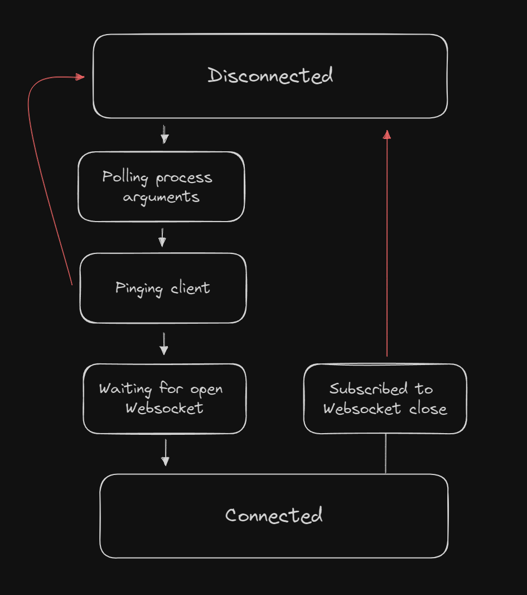

# Hexgate

[](https://discord.gg/HEd72YnzVq)
[](https://app.codacy.com/gh/cuppachino/hexgate?utm_source=github.com\&utm_medium=referral\&utm_content=cuppachino/hexgate\&utm_campaign=Badge_Grade)
[](https://github.com/cuppachino/hexgate/actions/workflows/release.yml)
[](https://github.com/cuppachino/hexgate/blob/528f647166eddef82e0ceb15ac8feafb56e97773/LICENSE)
[](https://www.npmjs.com/package/hexgate)

[Hexgate](https://www.npmjs.com/package/hexgate) is a work-in-progress LCU suite. It is **not** endorsed by Riot Games. You can find out more about what that means [here](https://www.riotgames.com/en/legal). Thank you Riot ❤️ for providing a public API for us to play with. If you have any questions, feel free to join the [cuppachino discord](https://discord.gg/HEd72YnzVq).

Please refer to the [wiki](https://github.com/cuppachino/hexgate/wiki) for more info.

<!-- todo: add more info -->

## Installation

Add it to your own project using your favorite package manager.

```shell
pnpm add hexgate
```

```shell
npm i hexgate
```

```shell
yarn add hexgate
```

### ESM

```ts
import { ... } from "hexgate"
```

### CJS

```ts
(async () => {
  const { ... } = await import("hexgate")
})()
```

## Authentication

Wait for the client by passing the [`auth`](https://github.com/cuppachino/hexgate/blob/main/src/modules/auth/index.ts) function to the [`poll`](https://github.com/cuppachino/hexgate/blob/1e35a420382523bf1b0bf60267aa8314fce7a457/src/utils/poll.ts) utility.

```ts
import { auth, poll } from "hexgate"

const credentials = await poll(auth)
```

Opt-out of safe authentication by explicity passing an `undefined` certifcate.

```ts
const unsafeCredentials = await auth({ certificate: undefined })
```

Once you have the credentials, you can create a new [`Hexgate`](./src/modules/hexgate/index.ts) and [`LcuClient`](./src/modules/websocket/index.ts).

```ts
import { Hexgate, LcuClient } from "hexgate"

const hexgate = new Hexgate(credentials)
const client = new LcuClient(credentials)
```

Working with multiple clients? Get get `all` credentials.

```ts
import { auth, createHexgate, createLcuClient, poll, zip } from 'hexgate'

const credentials = await poll(() => auth({ all: true }))

// ~ some multi-connection interface
const clients = new Set(
  zip(
    credentials.map(createHexgate),
    credentials.map(createLcuClient)
  )
)
```

## Builder API

The simplest way of getting started is to "`.build`" a request function. The builder uses generics to infer the parameters and return type of the request.

```ts
const hexgate = new Hexgate(credentials)

// (arg: string[], init?: any) => Promise<ApiResponse<{ ... }>>
const getSummonersFromNames = hexgate
  .build('/lol-summoner/v2/summoners/names')
  .method('post')
  .create()

const summoner = await getSummonersByName(['dubbleignite'])
console.log(summoner)
```

## Websocket Events

Subscribe to LCU events through the client.

```ts
const client = createLcuClient(credentials)

client.on('close', () => {
  client.unsubscribeAll()
})

client.subscribe(
  'OnJsonApiEvent_lol-champ-select_v1_session',
  ({ data, eventType, uri }) => {
    // side effects
  }
)
```

> Note: Since many endpoints will subscribe you to multiple uris, its difficult to provide meaningful type inference for the data property. Import `LcuComponents` type when necessary and/or open a PR to improve typings - which would be greatly appreciated!

## ⚡️ Connection

The [`Connection`](./src/modules/connection/index.ts) class further abstracts `Hexgate` & `LcuClient` and handles authentication between client shutdowns. Configuration is optional.

```ts
import { Connection } from 'hexgate'

const client = new Connection({
  // Recipe API (createRecipe or recipe)
  createRecipe({ build, wrap, unwrap }) {
    const to = unwrap('should never error!')
    return {
      getCurrentSummoner: wrap(
        build('/lol-summoner/v1/current-summoner').method('get').create()
      )({
        to
      })
    }
  },
  // Propagate status to browser windows.
  onStatusChange(status) {
    emit('status', status)
  },
  // Init
  async onConnect(con) {
    con.ws.subscribe('OnJsonApiEvent_lol-champ-select_v1_session', handleChampSelect)
    const summoner = await con.recipe.getCurrentSummoner()
    con.logger.info(summoner, `Welcome, ${summoner.displayName}`)
  },
  // Automatically reconnect
  async onDisconnect(discon) {
    await sleep(4000)
    discon.connect()
  },
  // Authentication interval
  interval: 2000,
  // Bring any logger
  logger: pino({
    name: 'main' as const
  })
})

client.connect()
```

The `Connection`'s implementation of the Recipe API comes in two flavors:

```ts
import { Connection, createRecipe } from 'hexgate'

const recipe = createRecipe(({ build }) => ({/*...*/}))
const client = new Connection({
  recipe
})
```

```ts
import { Connection } from 'hexgate'

const client = new Connection({
  createRecipe({ build }) { return {/*...*/} }
})
```

<p align='center'>
  
</p>

## Recipe API

[`createRecipe`](./src/modules/hexgate/recipe.ts) is a higher-order function for transforming a request's parameters and response. It is a useful tool for morphing the LCU's API into your own. There are several ways to use the functions provided by the callback, and we'll take a look at each one.

### Intro

#### Step 1: Create a recipe

This is identical to the builder API, except the request won't be built until a hexgate instance is passed to the recipe. This is useful for defining requests ahead of time or in another file.

```ts
import { createRecipe } from "hexgate"

/**
 * (hexgate: T) => (arg: string[], init?: RequestInit) => Promise<ApiResponse<{...}>>
 */
const getSummonersFromNamesRecipe = createRecipe(({ build }) =>
  build('/lol-summoner/v2/summoners/names')
    .method('post')
    .create()
)
```

#### Step 2: Once you have a recipe, you just need to pass it a `Hexgate` instance.

```ts
const getSummonersFromNames = getSummonersFromNamesRecipe(hexgate)

const summoners = await getSummonersFromNames(['dubbleignite'])
console.table(summoners.data)
```

### Transforming requests

#### Wrap

Calling `wrap` without any arguments will default to the request function returned by `build`. The following cases are all equivalent:

```ts
const summonersRecipe = createRecipe(({ build, wrap, unwrap }) => ({
  /**
  * (arg: { ids?: string; }, init?: RequestInit) => Promise<ApiResponse<{...}>>
  */
  fromIds_basic: build('/lol-summoner/v2/summoners')
    .method('get')
    .create(),

  /**
  * (arg: { ids?: string; }, init?: RequestInit) => Promise<ApiResponse<{...}>>
  */  
  fromIds_inferParams_noArg: wrap(
    build('/lol-summoner/v2/summoners').method('get').create()
  )(),

  /**
  * (arg: { ids?: string; }, init?: RequestInit) => Promise<ApiResponse<{...}>>
  */  
  fromIds_inferParams_undefinedMethods_0: wrap(
    build('/lol-summoner/v2/summoners').method('get').create()
  )({}),

  /**
  * (arg: { ids?: string; }, init?: RequestInit) => Promise<ApiResponse<{...}>>
  */  
  fromIds_inferParams_undefinedMethods_1: wrap(
    build('/lol-summoner/v2/summoners').method('get').create()
  )({
    from: undefined,
    to: undefined,
  })
}))
```

But really you probably want to use `wrap` to define transformations.

```ts
const summonersRecipe = createRecipe(({ build, wrap, unwrap }) => ({
  /**
   * (summonerIds: (number | `${number}`)[], init?: RequestInit | undefined) => Promise<ApiResponse<{...}>>
   */
  fromIds_parameters_can_be_overwritten: wrap(
    build('/lol-summoner/v2/summoners').method('get').create()
  )({
    // The return type is constrained by the request function.
    // Here it must extend [{ ids?: string }, RequestInit | undefined]
    from(summonerIds: Array<`${number}` | number>, init?) {
      return [{ ids: JSON.stringify(summonerIds) }, init]
    }
  }),

  /**
   * (arg: { ids?: string }, init?: RequestInit) => Promise<{...}>
   */
  fromIds_response_can_be_transformed: wrap(
    build('/lol-summoner/v2/summoners').method('get').create()
  )({
    // The response type is inferred from the request function.
    // here we are extracting the data property from the response.
    async to(response) {
      return (await response).data
    }
  }),

  /**
   * (summonerIds: (number | `${number}`)[], init?: RequestInit | undefined) => Promise<{...}>
   */
  fromIds_response_can_be_unwrapped: wrap(
    build('/lol-summoner/v2/summoners').method('get').create()
  )({
    from(summonerIds: Array<`${number}` | number>, init?) {
      return [{ ids: JSON.stringify(summonerIds) }, init]
    },
    // shorthand for the previous example with optional error message argument
    to: unwrap()
  }),
}))
```

### Exporting Recipes

If you want to export a recipe, you might get a type error. This is because the return type of `createRecipe` is inferred with references to `@cuppachino/openapi-fetch` and `node-fetch-commonjs`. To fix this, install the packages as dev dependencies and apply one of the following solutions to your `tsconfig.json`:

#### Map paths

```json
{
  "compilerOptions": {
    "paths": {
      "@cuppachino/openapi-fetch": ["./node_modules/@cuppachino/openapi-fetch"],
      "node-fetch-commonjs": ["./node_modules/node-fetch-commonjs"]
    }
  }
}
```

#### Add types to the global scope

```json
{
  "compilerOptions": {
    "types": ["@cuppachino/openapi-fetch", "node-fetch-commonjs"]
  }
}
```

## Development

This package uses [pnpm](https://pnpm.io) to manage dependencies. If you don't have pnpm, it can be installed globally using `npm`, `yarn`, `brew`, or `scoop`, as well as some other options. Check out the [pnpm documentation](https://pnpm.io/installation) for more information.

```ps1
pnpm i
```
